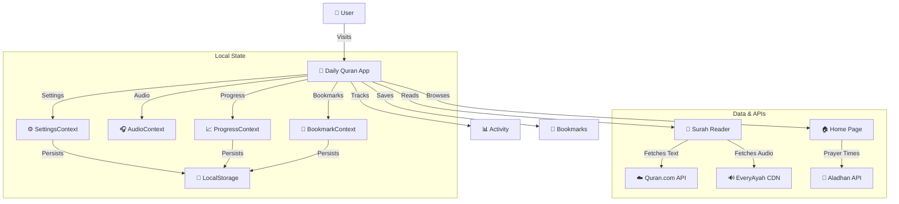

# 📖 9M2PJU Daily Quran

<p align="center">
  
</p>

> A modern, beautiful, and accessible Progressive Web App for reading and listening to the Holy Quran daily.

[](https://reactjs.org/)
[](https://www.typescriptlang.org/)
[](https://vitejs.dev/)
[](https://tailwindcss.com/)
[](https://web.dev/progressive-web-apps/)

## ✨ Features

### 📖 Quran Reading
- **Uthmani Script** — High-quality Arabic text with proper diacritics
- **27 Translations** — Including English, Malay, Indonesian, Turkish, French, Urdu, Bengali, and more
- **Real Tafsir Integration** — Toggle between multiple scholarly commentaries (Ibn Kathir, Ma'arif al-Qur'an, Tazkirul Quran, Al-Jalalayn) with real-time verse synchronization
- **Font Size Control** — Adjustable A-/A+ for comfortable reading
- **Focus Mode** — Immersive verse-by-verse reading with dimmed surroundings, auto-scroll, keyboard navigation, and auto-exit after the last verse

### 🎧 Audio Playback
- **10 World-Class Reciters** — Mishary Alafasy, Abdul Basit, As-Sudais, Saad Al-Ghamdi, Abu Bakr Ash-Shatri, Hani Ar-Rifai, Al-Husary, El-Minshawi, Al-Ajamy, Maher Al-Muaiqly
- **Precision Audio Controls** — Full playback control (Play/Pause, Next, Previous) directly from the persistent header
- **Full Surah Playback** — Continuous audio with verse highlighting and auto-scroll
- **Verse-by-Verse Play** — Tap play on any individual verse
- **Mobile Audio Player** — Floating player bar on mobile screens
- **Audio Auto-Stop** — Stops playback when navigating away from a surah

### 🔖 Bookmarks & Notes
- **Verse Bookmarking** — Save any verse with one tap
- **Personal Notes** — Add private notes to any verse
- **Bookmarks Page** — Dedicated page to browse all saved verses and notes

### 📊 Progress & Goals
- **Daily Verse of the Day** — Featured verse on the home page with play and share buttons
- **Reading Streaks** — Track consecutive days of reading
- **Daily Goals** — Set and monitor daily reading targets
- **Activity Page** — Stats dashboard with streak, verses read, bookmarks, notes, and recent activity

### 🕌 Prayer & Islamic Tools
- **Prayer Times** — GPS-based prayer time calculations with compass
- **Surah Index** — Browse all 114 surahs with search
- **Juz Index** — Browse by Juz (para) division
- **Library** — Curated collections for different reading goals

### 📱 Design & UX
- **Dark Mode** — Elegant dark green theme designed for night reading
- **Vertically Centered Layout** — Symmetrical and distraction-free reading column
- **Fully Responsive** — Optimized for mobile, tablet, and desktop
- **PWA Ready** — Install as a native app on any device
- **Smooth Animations** — Polished transitions and micro-interactions

## 🏗️ Architecture



## 🚀 Getting Started

### Prerequisites

- Node.js (v18 or higher)
- npm or yarn

### Installation

1. Clone the repository:
   ```bash
   git clone https://github.com/9M2PJU/9M2PJU-Daily-Quran.git
   ```
2. Install dependencies:
   ```bash
   npm install
   ```
3. Start the development server:
   ```bash
   npm run dev
   ```

## 📦 Deployment

This project is configured to deploy automatically to GitHub Pages using GitHub Actions.

- **Production URL**: [https://quran.hamradio.my](https://quran.hamradio.my)
- **CI/CD**: `.github/workflows/deploy.yml`

## 🛠️ Built With

- **[React 19](https://reactjs.org/)** — UI Library
- **[Vite](https://vitejs.dev/)** — Build Tool
- **[TypeScript](https://www.typescriptlang.org/)** — Type Safety
- **[Tailwind CSS 4](https://tailwindcss.com/)** — Utility-First Styling
- **[React Router](https://reactrouter.com/)** — Client-Side Routing
- **[Quran.com API](https://quran.com/api)** — Quran Text & Translations
- **[EveryAyah.com](https://everyayah.com/)** — Audio Recitations
- **[Aladhan API](https://aladhan.com/prayer-times-api)** — Prayer Times
- **[Material Symbols](https://fonts.google.com/icons)** — Icons

## 📋 Changelog

### v1.3.1 (Feb 2026)
- 🆕 **Real Tafsir Scholar Selector** — Integrated Quran.com API for live exegesis from multiple scholars
- 🆕 **Persistent Audio Controls** — Header player now works instantly without manual activation
- 🔧 **Surah Layout Fix** — Centered vertical alignment for a more premium reading experience
- 🔧 **Performance Bump** — Optimized Context rendering with `useMemo` for stable playback

### v1.2.0
- 🆕 Focus Mode with verse-by-verse navigation and auto-scroll
- 🆕 10 Quran reciters with selection in Settings
- 🆕 Bookmarks & Personal Notes system
- 🔧 Audio auto-stop on page exit

## 📄 License

This project is open source and available under the [MIT License](LICENSE).

---

<p align="center">
  Made with ❤️ by <a href="https://github.com/9M2PJU">9M2PJU</a>
</p>
