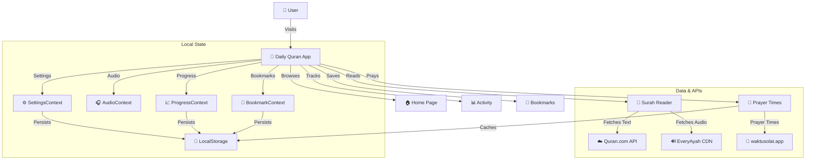

# 📖 9M2PJU Daily Quran

<p align="center">
  
</p>

> A modern, beautiful, and accessible Progressive Web App for reading and listening to the Holy Quran daily.

**🌐 Live:** [quran.hamradio.my](https://quran.hamradio.my)

[](https://reactjs.org/)
[](https://www.typescriptlang.org/)
[](https://vitejs.dev/)
[](https://tailwindcss.com/)
[](https://web.dev/progressive-web-apps/)
[](LICENSE)

---

## ✨ Features

### 📖 Quran Reading
- **Uthmani Script** — High-quality Arabic text with proper diacritics
- **27 Translations** — English, Malay, Indonesian, Turkish, French, Urdu, Bengali, and more
- **Real Tafsir Integration** — Toggle scholarly commentaries (Ibn Kathir, Ma'arif al-Qur'an, Tazkirul Quran, Al-Jalalayn) with real-time verse sync
- **Font Size Control** — Adjustable A-/A+ for comfortable reading
- **Focus Mode** — Immersive verse-by-verse reading with dimmed surroundings, auto-scroll, keyboard navigation, and auto-exit after the last verse

### 🎧 Audio Playback
- **10 World-Class Reciters** — Mishary Alafasy, Abdul Basit, As-Sudais, Saad Al-Ghamdi, Abu Bakr Ash-Shatri, Hani Ar-Rifai, Al-Husary, El-Minshawi, Al-Ajamy, Maher Al-Muaiqly
- **Persistent Audio Controls** — Play/Pause, Next, Previous from the header bar
- **Full Surah Playback** — Continuous audio with verse highlighting and auto-scroll
- **Verse-by-Verse Play** — Tap play on any individual verse
- **Mobile Audio Player** — Floating player bar on mobile screens
- **Audio Auto-Stop** — Stops playback when navigating away

### 🔖 Bookmarks & Notes
- **Verse Bookmarking** — Save any verse with one tap
- **Inline Personal Notes** — Add/edit notes directly in the verse card when bookmarking
- **Bookmarks Page** — Dedicated page to browse all saved verses and notes
- **Edit Note Button** — Quick access to edit existing notes without unbookmarking

### 📊 Progress & Goals
- **Daily Verse of the Day** — Featured verse on the home page with play and share buttons
- **Reading Streaks** — Track consecutive days of reading
- **Daily Goals** — Set and monitor daily reading targets
- **Activity Page** — Stats dashboard with streak, verses read, bookmarks, notes, and recent activity

### 🕌 Prayer & Islamic Tools
- **Prayer Times** — GPS-based prayer times via [waktusolat.app](https://waktusolat.app) (JAKIM method for Malaysia)
- **Syuruk (Sunrise)** — Displayed alongside the 5 daily prayers
- **Qibla Direction** — Locally calculated bearing to Kaaba with distance, cardinal direction, and DMS coordinates
- **Zone Auto-Detection** — Automatically detects your JAKIM zone from GPS coordinates
- **Surah Index** — Browse all 114 surahs with search
- **Juz Index** — Browse by Juz (para) division
- **Library** — Curated collections for different reading goals

### 📱 Design & UX
- **Dark Mode** — Elegant dark green theme designed for night reading
- **Fully Responsive** — Optimized for mobile, tablet, and desktop with dedicated navigation for each
- **PWA Install Button** — One-tap install from the Settings page, works as a native app on any device
- **Smooth Animations** — Polished transitions and micro-interactions via Framer Motion
- **Screen Wake Lock** — Prevents screen dimming during audio playback

### ⚡ Performance
- **Lazy-Loaded Routes** — Code-split pages for smaller initial bundle
- **LocalStorage Caching** — Prayer times and geolocation cached for instant repeat visits
- **Background Prefetch** — Prayer data fetched silently from the Home page
- **Skeleton Loading** — Layout-matching placeholders instead of spinners

---

## 🏗️ Architecture



---

## 🛠️ Built With

| Technology | Purpose |
|---|---|
| [React 19](https://reactjs.org/) | UI Library |
| [Vite 7](https://vitejs.dev/) | Build Tool |
| [TypeScript 5.9](https://www.typescriptlang.org/) | Type Safety |
| [Tailwind CSS 4](https://tailwindcss.com/) | Utility-First Styling |
| [React Router 7](https://reactrouter.com/) | Client-Side Routing |
| [Framer Motion](https://www.framer.com/motion/) | Animations |
| [Quran.com API](https://quran.com/api) | Quran Text & Translations |
| [EveryAyah.com](https://everyayah.com/) | Audio Recitations |
| [waktusolat.app](https://api.waktusolat.app) | Prayer Times (JAKIM) |
| [Material Symbols](https://fonts.google.com/icons) | Icons |

---

## 🚀 Quick Start

```bash
# Clone the repository
git clone https://github.com/9M2PJU/9M2PJU-Daily-Quran.git
cd 9M2PJU-Daily-Quran

# Install dependencies
npm install

# Start development server
npm run dev

# Build for production
npm run build

# Deploy to GitHub Pages
npm run deploy
```

---

## 📋 Changelog

See [CHANGELOG.md](CHANGELOG.md) for the full release history.

---

## 📄 License

This project is open source and available under the [GNU Affero General Public License v3.0](LICENSE).

---

<p align="center">
  Made with ❤️ by <a href="https://github.com/9M2PJU">9M2PJU</a><br/>
  <em>"Guide us to the straight path." — Surah Al-Fatihah 1:6</em>
</p>
