# 📖 Daily Quran PWA


> A modern, beautiful, and accessible Progressive Web App for reading and listening to the Holy Quran daily.

[](https://reactjs.org/)
[](https://www.typescriptlang.org/)
[](https://vitejs.dev/)
[](https://tailwindcss.com/)
[](https://web.dev/progressive-web-apps/)

## ✨ Features

- **📖 Crystal Clear Text**: High-quality Uthmani script for authentic reading experience.
- **🎧 Continuous Audio**: Integrated audio player featuring Mishary Rashid Alafasy.
- **🌍 Multi-Language Support**:
  - English (Saheeh International)
  - Malay (Abdul Hameed)
  - Indonesian (Kemenag)
- **🌙 Dark Mode**: Beautifully designed dark theme for comfortable night reading.
- **💾 Progress Saving**: Automatically remembers the last Surah you read.
- **📱 PWA Ready**: Install on your phone or desktop for an app-like experience.
- **⚡ Blazing Fast**: Built with Vite and React for instant load times.

## 🏗️ Architecture

```mermaid
graph TD
    User[👤 User] -->|Visits| App[📱 Daily Quran App]
    App -->|Browses| Home[🏠 Home / Surah Index]
    App -->|Selects Surah| Reader[📖 Surah Reader]
    
    subgraph "Data & State"
        Reader -->|Fetches Text| API[☁️ Quran.com API]
        Reader -->|Fetches Audio| Audio[🔊 Audio CDN]
        App -->|Persists| Storage[💾 LocalStorage]
    end

    subgraph "Features"
        Storage -->|Theme| DarkMode[🌙 Dark Mode]
        Storage -->|Lang| Lang[🌍 Translation]
        Storage -->|History| LastRead[🔖 Last Read]
    end
```



## 🚀 Getting Started

### Prerequisites

- Node.js (v18 or higher)
- npm or yarn

### Installation

1. Clone the repository:
   ```bash
   git clone https://github.com/9M2PJU/daily-quran.git
   ```
2. Install dependencies:
   ```bash
   npm install
   ```
3. Start the development server:
   ```bash
   npm run dev
   ```

## 📦 Deployment

This project is configured to deploy automatically to GitHub Pages using GitHub Actions.

- **Production URL**: [https://quran.hamradio.my](https://quran.hamradio.my)
- **CI/CD**: `.github/workflows/deploy.yml`

## 🛠️ Built With

- **[React](https://reactjs.org/)** - UI Library
- **[Vite](https://vitejs.dev/)** - Build Tool
- **[Framer Motion](https://www.framer.com/motion/)** - Animations
- **[Lucide React](https://lucide.dev/)** - Icons
- **[Quran.com API](https://quran.com/api)** - Data Source

## 📄 License

This project is open source and available under the [MIT License](LICENSE).

---

<p align="center">
  Made with ❤️ by <a href="https://github.com/9M2PJU">9M2PJU</a>
</p>
